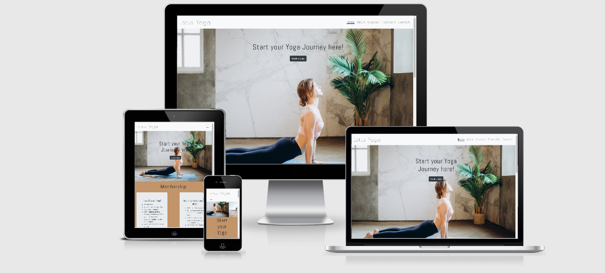

# Lotus Yoga Website

[View live website here.](https://dovi-k.github.io/lotus-yoga-ms1/)

The website is created to promote a new vibrant yoga studio and to increase the flow of new students
 as well as to increase students who sign up for the monthly membership.

 Promoting yoga, mindfulness and wellbeing is at the core of Lotus Yoga values.

The Website is accesible on a range of devices making it easy to navigate. 

## User Experience (UX)

I've tried to make the navigation as simple as possible. 
The navigation bar has a fixed position
so when you are scrolling through the pages you can easlily access it.

Each page is not overloaded with text. Fot the teachers section I've used 
collapse function to keep it visually pleasing to the viewvers eye.
 

 
 Membership information is displayed in the Welcome page inviting users to sign up or try their
 first class with the studio for free.

 
Contact form has it's own page and it's easily accesible to the students. 

### User Stories

<ul>
<li>	As a user, I want to easily access the menu bar so I could navigate the website</li>
 <li>As a user, I want to know more about the studio </li>
<li>	As a user, I want to see the membership options and prices</li>
<li>	As a user, I want to be able to book a class online</li>
<li>	As a user, I want to see the tutors that are giving the classes in the studio</li>
<li>	As a user, I want to locate the studio</li>
 <li>As a user, I want to easily access the contact information of the studio</li>
<li>	As a user, I want to see the classes that are offered in the studio</li>
<li>	As a user, I want to get in touch with the questions I have</li>
<li>	As a user, I want to see the timetable of the classes</li>
<li>	As a user, I want to have the links to the social media</li> 

</ul>

### Owner Stories

<ul>
<li>	As the site owner, I want new customers to sign up for the first free class</li>
<li>	As the site owner, I want to provide studio information on classes, tutors and our mission to the potential customers</li>
<li> As the site owner, I want my customers be able to locate the studio</li>
<li>As the site owner, I want my users to be able to book a class online</li>
<li>	As the site owner, I want to provide the class timetable for booking</li>
<li>	As the site owner, I want as many customers to choose the monthly membership</li>

</ul>

### Design

I tried to keep website design simple and clean. 

#### Color Scheme
I tried to stay with warm earthy colors. 
Developing it further I would implement more variety and contrast.
Due to time limits I wasn't able to take experment as much as I would have liked to.
 
 #### Typography
 Logo was created using "Poiret One" (fallback "cursive") to minimalistic and modern look. 
 For the paragraphs I've used "Roboto" with fall back "sans serif" and 
 the main headings "Abel" to be contrasting with the Logo design,
  "sans serif" was used for the headings as a fall back font as well.

#### Imagery
Images on the website are inviting. Large Hero images on the landing page
are in slideshow and grabs your attention staright away. Inviting you to the studio.

Most of the pictures used are of yoga teachers and students in the class or yoga poses.
Allowing the user to picture themselves in their place and get a better idea what to expect.

All images were taken from the free stock photos websites:

* [Pexels](https://www.pexels.com/)
* [Pexabay](https://pixabay.com/images/)
* The only picture taken from personal portfolio is in Wecome page
 Teacher section (Dovile) picture was taken by Barry Gibons</li>
The technology used for pictures was Paint 3D I used Resizing pictures to 
so that tehy would nicely align in the class section and teachers section as I had a 
difficulty at first wanting to make them in a circle but because of their parameters 
the pictures were distorted.

### Wireframes

In the wireframes available there are extra sections that may be implement
as the Yoga Studio grows. As I went on to design I had to leave out certain parts.

* [Mobile Wireframe](wireframes/mobilewireframe.pdf) 
* [Tablet Wireframe](wireframes/tabletwireframe.pdf)
* [Website Wireframe](wireframes/websitewireframe.pdf)

## Features to implement

Going ahead with the yoga studio the website design would be slightly asjusted.
Also site is not fully functional.

- Making the contact page live and functional
- Use of a CNAME (Canonical Name) URL
- Creating classes online booking system
-  Adding payment options
- Adding google maps to the contact page with the studio location.
- Making contact page live
- Adding functionality to all the buttons
- Going forward with the project and the studio I would like to create 
members log in and special functions for members.
- Adding shopping page for studio merch items like yoga mats, towels, water bottles with the brand
to the page.

## Bugs to fix
- fixing the responsiveness on diffrent devices. The websites still
needs quite a lot of work on that.
- the main image is taking too much space of on the main HOME page.
I would fit so you owuld see full view of teh image slidehow without having
to scroll down a little bit.
- margins-left for the images in classes.html the gap is slightly too big.
and then when that page is resizes give the images some bottom margin to give space between
text and the images.
- timetable responsiveness
- memberships respinsiveness 
- adding the href to The Memberships so you oudl be brought directly to 
the Membership section of the timetable.html instead of being just brought
into timetable.html
- footer it moves up depending on the responsiveness
- contact form adjust alignments with the adress information
- the menu bar is hidden on the left side on different devices

## Teachnologies used

1.	[Bootstrap 4.4.1:](www.getbootsrap.com)
<li>	Bootstrap was used to assist with the responsiveness and styling of the website.
</li>

2.	Hover.css:
	Hover.css was used on the Social Media icons in the footer to add the float transition while being hovered over.
As well on the site Logo and Menu Items.
3.	[Google Fonts:](fonts.google.com)
o	Google fonts were used to import the "Poiret One", "Abel", "Roboto" fonts into the style.css file which are used on all pages throughout the project.
4.	[Font Awesome:](www.fontawesome.com)
o	Font Awesome was used on all pages footer to add Social media icons for aesthetic and UX purposes.
5.	jQuery:
o	jQuery came with Bootstrap to make the navbar responsive.
6.	Git
o	Git was used for version control by utilizing the Gitpod terminal to commit to Git and Push to GitHub.
7.	GitHub:
o	GitHub is used to store the projects code after being pushed from Git.
I was not using it the correctly at the very beginning of my project
for this reason there are a lot of commits missing at the very beginning of the project.
8.	Paint 3D:
o	Paint 3D was used for resizing images for the website.
9.	[Balsamiq:](www.balsamiq.com)
o	Balsamiq was used to create the wireframes during the design process
## Tools used
To create my website I used these languges and tools
* [HTML](https://html.com/)
* [CSS](https://www.w3.org/Style/CSS/Overview.en.html) 
* [Bootstrap](https://getbootstrap.com/)
* [GitHub](https://github.com/)
* [GitPod](https://www.gitpod.io/)
## Deployment
1. Log in to your GitHub account
2. Select repository that you would like to Deploy
3. Go to Settings icon the (top right of the page)
4. Scroll down to the GitHub Pages section
5. Select "Master Branch" in the dropdown
6. Your project will be deployed and you will get your URL https://dovi-k.github.io/lotus-yoga-ms1/ 

##  Testing
For testing my code I used 
* [W3C HTML Validator](https://validator.w3.org/) to check validity of my HTML code.
* [W3C CSS Validator](https://jigsaw.w3.org/css-validator/) - to check validity of my CSS code.
*	The Website was tested on Google Chrome and Internet Explorer I did available option to test it on Safari.
*	The website was viewed on a variety of devices such as Desktop, Laptop and Samsung S8.
*	A large amount of testing was done to ensure that all pages were linking correctly.
*	Friends and family members were asked to review the site and documentation to point out any bugs and/or user experience issues
* [Further testing can be found here](Testing.md) 

## Credits

### Code
*	The full-screen Hero-image slideshow came from [Youtube tutorial](https://www.youtube.com/watch?v=pGHOaY4dhAA)
*	Bootstrap4: Bootstrap Library used throughout the project mainly to make site responsive using the Bootstrap Grid System.
Also for navigation bar.
* Header and footer structures was used from
 [Claire Lally poject](https://github.com/ClaireLally8/TravellingDTrainer)
 * "Customer reviews" section from CI Whiskey project
 *Timetable and contact form structures I used from student
 [Michelle Clement project](https://github.com/michellelclement/yoga-flow-ms1)
* [W3School](www.w3school.com) was a huge help applying differnt features throughout the project
* As well as all [Code Institute](www.codeinstitute.com) mini projects I took quite a lot of inspirations from them

### Content
* All content was written by the developer.
 I took inspiration for content as well as design from
websites like [YogaHub](www.yogahub.ie), [DevaYoga](www.devayoga.co.uk).
Also used quotes from [Table for Change](https://tableforchange.com/yoga-quotes/).
</li>

### Media
*	[Pexels](www.pexels.com) and [Pexelbay](www.pexelbay.com) 
* [Responsiveness image](http://ami.responsivedesign.is/#)

### Acknowledgements

* My Mentor for continuous helpful feedback. 
* [Slack community](www.slack.com)
* Tutor support at Code Institute for their support and help answering questions
and helping me to find solutions when I was coming to the dead ends. </li>
* [Code Institute](www.codeinstitute.net) and student support team especially [Claire Lally](https://github.com/ClaireLally8) for her help going an extra mile 
and inspiration
* [Stack Overflow](www.stackoverflow.com) 

