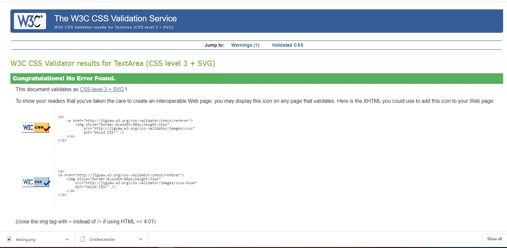
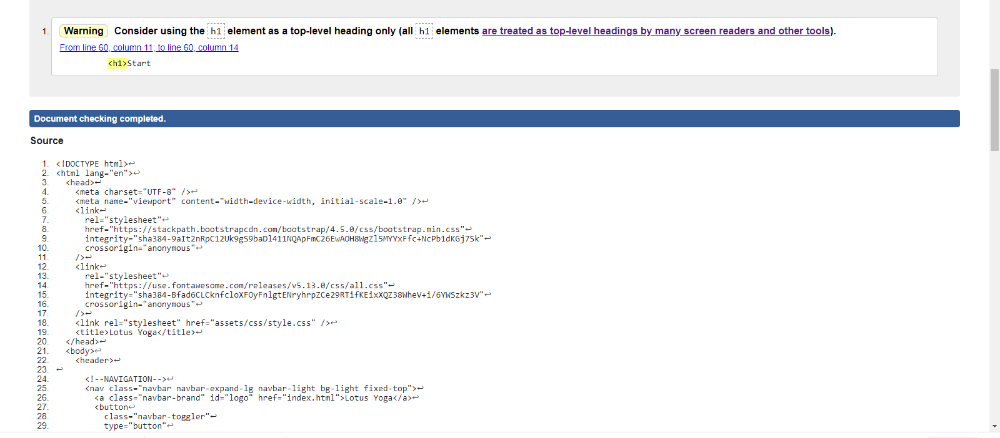
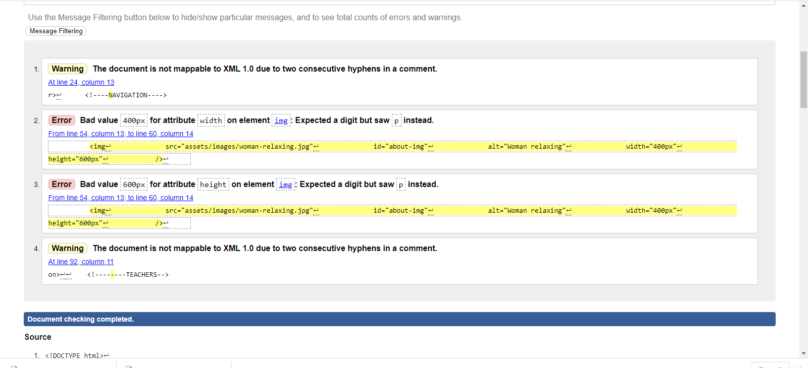
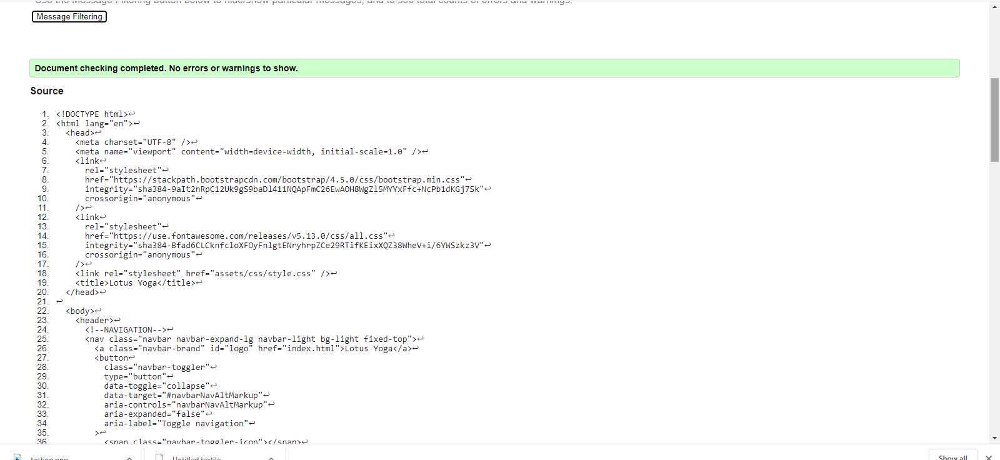
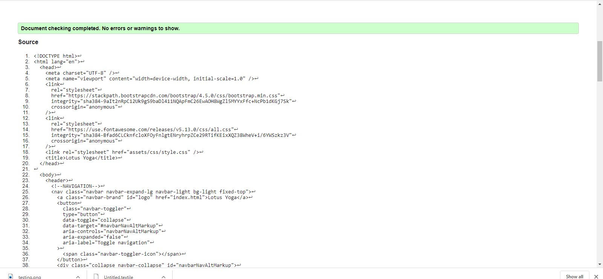
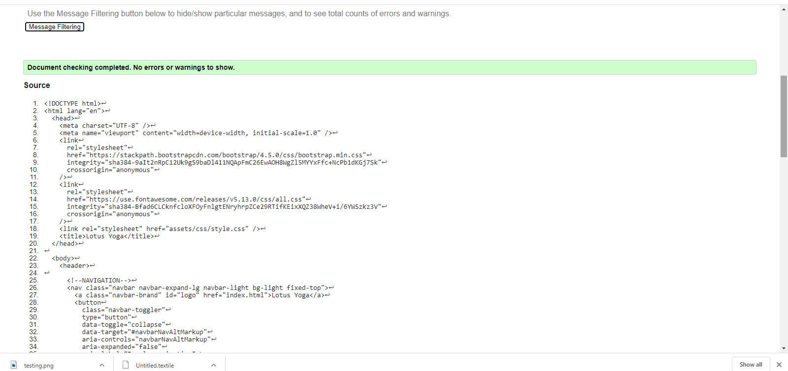
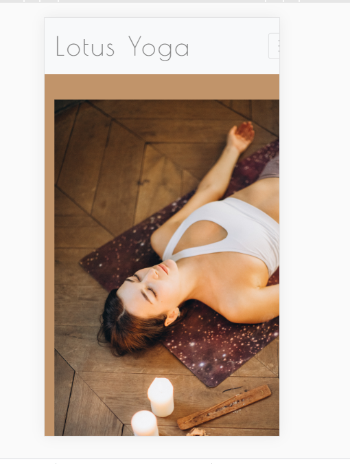

# Testing

I kept continuasly testing and checking my Website using DevTools all 
thoughout the process. I didn't document every little adjustment I've made,
just couple of difficult bugs.
The Website is still not entirely responsive. I've put it as much work
as I currently was capable of to fix as many issues as possible 
but due to time constrain I had to settle with leaving certain bugs to be 
solved later.

## CSS Validator testing

CSS code was valid with no errors.

## HTML Validator 

### Checking index.hmtl code
There were no Errors found in my index.html however I did received Warning
for using h1 on my hero image after consulting tutor, he suggested 
reasured that I can leave the Warning to stay there and it won't be 
counted as error. 

### Testing about.html
I've got couple of errors in this page. One was related to using extra 
hyphens for the comments and the second one was wrong value for the image, which
I left unfortunately unsolved because setting the height and width values
allowed me to resize the picture the way I wanted, going forward with the project
Iwould definetly resolve the issue.

### Testing classes.html 
There were no errors found in the code.

### Testing timetable.html
There were no errors.

### Testing contact.html
There were no errors found.

## Testing on different Browsers

### Google Chrome

I was mostly working on Google Chrome. The main page usually takes to load
and the h1 gets little bit out of proportions and overlaps with Memberships header until the page loads.

### Opera

I didn't register any big issues with Opera browser. I've noticed that the colors
seemed to be more virant on this browser though.

### Internet Explorer
No obvious issues apeared testing on the Interner Explorer Browser.

## Testing on different devices

### Testing on Galaxy S5 phone
*The Home Page slide images resized nicely
*The Header slided down from the images and apeared just after the slideshow.
The only problem was that the font stayed a slightly too big after resizing.

*Due to unresolved issue with about.html image the picture does not responsive to different 
devices. Also you need to scroll little sideways to get to the menu.

* Timetable sections width was little bit to wide as well, the menu was hidden on the left side. The Tmetable gotslightly squashes
when resized.
* Contact page was fine.

### Testing on iphone6/7/8

* Similar to teh Samsung testing the header is quite big
and about.html and timetable.html menu is hidden in the left corner

### iPad Pro 

* Landing page looked good.
* the nav bar didn't toggle on the iPad
* about.html has a slight scroling to the side
* in the classes page the Footer is little bit up not at the very bottom
as expected. Leaving a 30 px gap between it and the end of the page.
* timetable page was fine
* Contact page footer is not at the nvery bottom leaving a gap